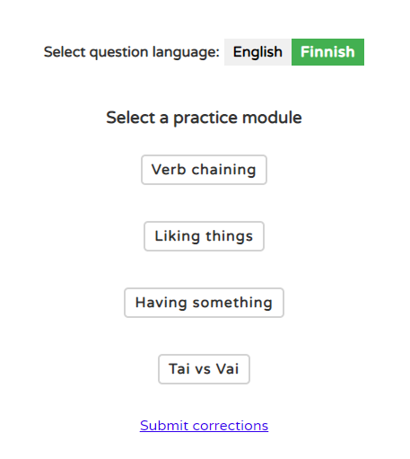
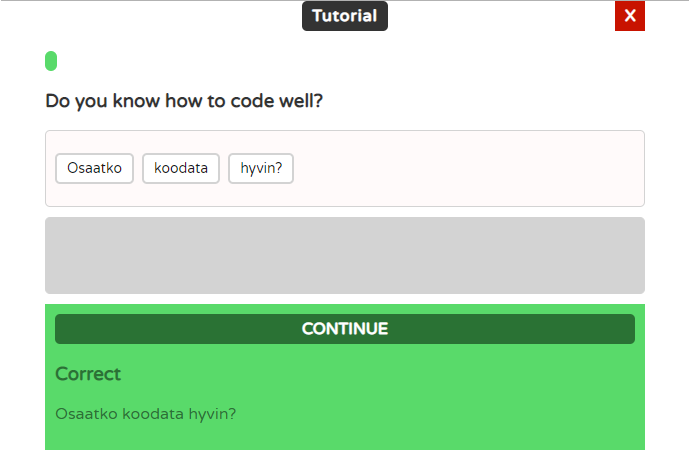

# React version 

This is the react version, which uses functional react components with Context and Hooks. 

This version uses MongoDB for data storage.

Basic CRUD operations to MongoDB have been created with Express on the backend. 

Working demo: [http://codinginthecold.byethost5.com/demos/finnish-practice/](http://codinginthecold.byethost5.com/demos/finnish-practice/)

### Screenshots

**Menu screen**

**Practice screen**

